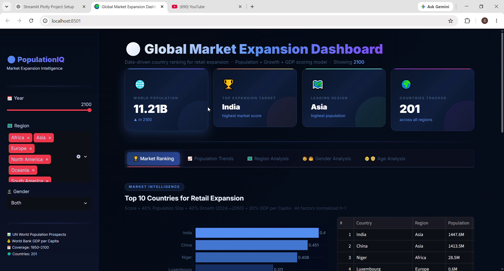
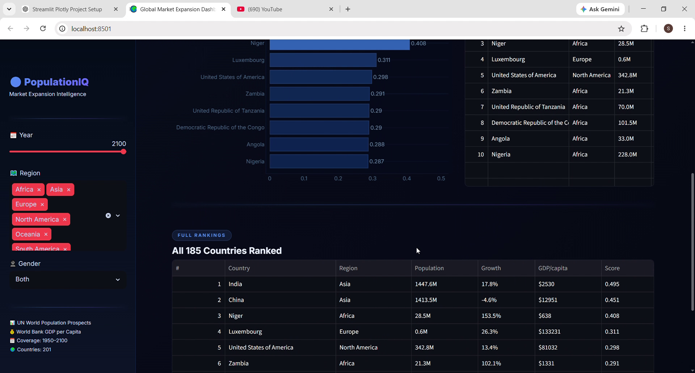
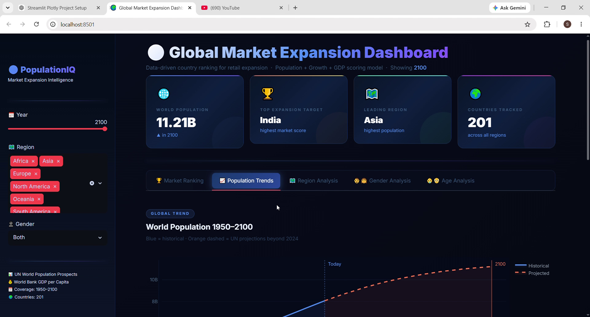
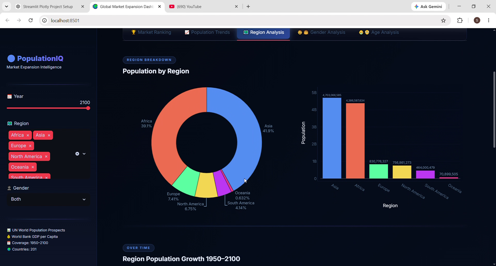
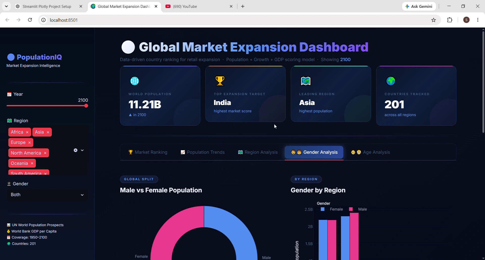
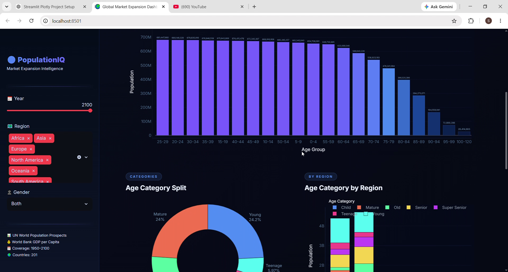

# 🌍 Global Market Expansion Intelligence Dashboard

**Which 10 countries should a retail company prioritize for expansion in the next decade?**

This repository contains my complete data engineering project — a full Python pipeline processing 150 years of UN population data combined with World Bank GDP data, deployed as an interactive Streamlit dashboard that answers this exact question.

**A transparent, defensible scoring model built from real demographic and economic data.**

---

## 📋 Table of Contents

1. [Project Overview](#-project-overview)
2. [Business Question](#-business-question)
3. [Dataset Description](#-dataset-description)
4. [Data Pipeline & Methodology](#-data-pipeline--methodology)
5. [Star Schema Design](#-star-schema-design)
6. [Scoring Model](#-scoring-model)
7. [Key Findings](#-key-findings)
8. [Dashboard Features](#-dashboard-features)
9. [Technical Implementation](#️-technical-implementation)
10. [Project Structure](#-project-structure)
11. [How to Run](#-how-to-run)
12. [Data Limitations](#️-data-limitations)
13. [Sources](#-sources)

---

## 🎯 Project Overview

**Project Type:** Data Engineering + Business Analytics + Interactive Dashboard
**Domain:** Global Demographics & Market Intelligence
**Data Coverage:** 201 countries · 1950–2100 · 1M+ rows
**Tools Used:** Python, pandas, Streamlit, Plotly, World Bank API
**Live Dashboard:** [View on Streamlit Cloud](https://world-population-analysisworld-population-analysis-xrqxey8wzwq.streamlit.app/)

### Executive Summary

A retail company expanding into new markets needs to answer three questions:
- **Where are the people?** → Population size
- **Where will the people be?** → Population growth (2024→2050)
- **Can they afford to buy?** → GDP per capita

This project builds a scoring model combining all three factors — normalized and weighted — to rank 185 countries and surface the top 10 most promising retail expansion targets.

---

## 💼 Business Question

> *"A consumer goods retail company wants to identify which 10 countries to prioritize for market expansion over the next 10 years. Which countries offer the best combination of large population, demographic growth, and purchasing power?"*

### Why These Three Factors?

| Factor | Weight | Reasoning |
|--------|--------|-----------|
| Population Size (2024) | 40% | Larger population = larger addressable market |
| Population Growth (2024→2050) | 40% | Forward-looking — avoids markets that are shrinking |
| GDP per Capita (2023) | 20% | Proxy for purchasing power — people need income to spend |

GDP was weighted lower (20%) because population momentum matters more for long-term retail than current income — a growing middle class in a large country often outperforms a rich but stagnant small one.

---

## 📊 Dataset Description

### Data Sources

| Source | Dataset | Period | Records | Key Fields |
|--------|---------|--------|---------|------------|
| UN World Population Prospects | Population by country, age, gender | 1950–2100 | 1,031,551 rows | Country, Year, Age Group, Gender, Population |
| World Bank API | GDP per capita (current US$) | 2023 | 201 countries | Country ISO3 code, GDP value |
| ISO 3166-1 | Country codes & region mapping | — | ~250 countries | Numeric ID, ISO3 code, Continent |

### Raw Files

| File | Description | Rows |
|------|-------------|------|
| `Population-country-1950-1999.csv` | Historical population data | ~605,000 |
| `Population-country-2000-2049.csv` | Current estimates & near-future projections | ~211,000 |
| `Population-country-2050-2100.csv` | Long-range UN projections | ~215,000 |
| `codes-country-region.txt` | Country codes + continent mapping | ~250 |

---

## 🔧 Data Pipeline & Methodology

The project follows a full ETL pipeline from raw source files to an interactive dashboard.

```
Raw CSVs (3 files, 1M+ rows)
        ↓
  EXTRACT & MERGE
        ↓
clean_population.csv  ←── Fix Excel date corruption (09-May → 5-9)
        ↓                  Melt Male/Female into long format
  TRANSFORM                Multiply population × 1000 (source in thousands)
        ↓
┌──────────────┐  ┌──────────┐  ┌────────────────┐  ┌──────────────┐
│  Dim Region  │  │  Dim Age │  │  Fact Table    │  │  GDP Table   │
│  (201 rows)  │  │ (21 rows)│  │ (1,210,422 rows│  │  (201 rows)  │
└──────────────┘  └──────────┘  └────────────────┘  └──────────────┘
        ↓                ↓               ↓                   ↓
                    SQLite Database (population.db)
                              ↓
                    Scoring Model (Python)
                              ↓
                    Streamlit Dashboard
```

### Key Cleaning Steps

**1. Excel Date Corruption Fix**
Excel auto-converts certain age group labels — discovered and fixed:

| Raw (corrupted) | Fixed |
|----------------|-------|
| `09-May` / `9-May` | `5-9` |
| `14-Oct` | `10-14` |

**2. North America Region Code**
pandas reads `"NA"` (North America code) as Python `NaN` by default. Fixed using `keep_default_na=False` — recovered 28 North American countries from being misclassified.

**3. World Bank API Filtering**
World Bank's GDP endpoint returns regional aggregates (e.g., "Euro area," "World") mixed with real countries. Filtered using trusted ISO3 codes from the UN codes reference file — reduced from 266 records to 201 real countries.

**4. Sudan Country ID Mismatch**
Discovered during join validation: population data used `729` for Sudan, GDP data used `736`. Fixed by standardizing to `729` for consistency.

**5. Population Multiplication**
Source values are in thousands — multiplied by 1,000 to get actual population numbers.

---

## ⭐ Star Schema Design

Data is modelled using a **Star Schema** — a standard data warehousing pattern — with one central Fact Table and three Dimension Tables.

```
              Dim Region
          ┌───────────────┐
          │ Country ID PK │
          │ country       │
          │ Region        │
          └───────┬───────┘
                  │
  Dim Age    ┌────▼──────────────┐
┌──────────┐ │   Fact Table      │
│ Age ID PK├─┤ Country ID     FK │
│ Age Group│ │ Age Group ID   FK │
│ Age Cat  │ │ Year              │
└──────────┘ │ Gender            │
             │ Population        │
             └────────┬──────────┘
                      │
              ┌───────▼──────────┐
              │   GDP Table      │
              │ Country ID    FK │
              │ Country          │
              │ ISO3 Code        │
              │ Year             │
              │ GDP_Per_Capita   │
              └──────────────────┘
```

**Why Star Schema instead of one flat table?**
- Eliminates redundancy — country name and region stored once, not in 1.2M rows
- Enables efficient aggregation queries
- Mirrors real-world BI/data warehouse design that companies actually use
- Easier to extend — adding new dimensions doesn't require restructuring the fact table

---

## 📐 Scoring Model

Each country is scored on three normalized factors, combined with weights:

```
Final Score = (Score_Population × 0.40)
            + (Score_Growth     × 0.40)
            + (Score_GDP        × 0.20)
```

**Normalization formula (Min-Max scaling):**
```
Normalized Value = (Value - Min) / (Max - Min)
```
This scales every factor to a 0–1 range so they're comparable regardless of units (millions of people vs. USD vs. growth percentage).

**Growth Rate calculation:**
```
Growth Rate = (Population_2050 - Population_2024) / Population_2024
```

---

## 📈 Key Findings

### Top 10 Countries for Retail Expansion

| Rank | Country | Region | Population (2024) | Growth (→2050) | GDP/Capita |
|------|---------|--------|------------------|----------------|------------|
| 1 | Nigeria | Africa | ~225M | ~70%+ | ~$2,139 |
| 2 | India | Asia | ~1.45B | ~10% | ~$2,530 |
| 3 | DRC | Africa | ~100M | ~85%+ | ~$660 |
| 4 | Ethiopia | Africa | ~130M | ~60%+ | ~$1,056 |
| 5 | Pakistan | Asia | ~240M | ~40%+ | ~$1,360 |
| 6 | Tanzania | Africa | ~65M | ~120%+ | ~$1,224 |
| 7 | Egypt | Africa | ~105M | ~40%+ | ~$3,457 |
| 8 | Philippines | Asia | ~115M | ~25%+ | ~$3,804 |
| 9 | Uganda | Africa | ~45M | ~150%+ | ~$1,002 |
| 10 | Kenya | Africa | ~55M | ~70%+ | ~$1,943 |

### Key Insight
Africa dominates the top 10 — not because of current wealth, but because of **demographic momentum**. These markets are growing faster than anywhere else on Earth. A retail company entering now positions itself for the next 30 years of middle-class growth, not just the next 3.

### Key Metrics Summary

| Category | Metric | Value | Context |
|----------|--------|-------|---------|
| **Data** | Total rows processed | 1,210,422 | Fact table after cleaning |
| | Countries covered | 201 | UN + World Bank matched |
| | Year range | 1950–2100 | Historical + projections |
| **Pipeline** | Cleaning steps | 5 major fixes | Excel corruption, NA code, Sudan ID etc. |
| | Tables built | 4 | Dim Region, Dim Age, Fact, GDP |
| **Scoring** | Countries ranked | 185 | After excluding 16 missing GDP |
| | Countries excluded | 16 | Sanctioned states + small territories |
| **Top Finding** | Africa in top 10 | 6 out of 10 | Demographic momentum |
| | Fastest growing market | Uganda | ~150% growth by 2050 |
| | Largest market | India | ~1.45B people |

---

## 📊 Dashboard Features

**🏆 Tab 1: Market Ranking**
- Top 10 expansion targets with score breakdown
- Horizontal bar chart with gradient coloring
- Full ranked table of all 185 countries (sortable)
- Score methodology explained inline




---

**📈 Tab 2: Population Trends**
- World population 1950–2100 (historical + UN projection)
- Top 10 most populous countries (filtered by selected year)
- Country vs Country comparison (user selects any 2 countries)
- Region growth trends over time



---

**🗺️ Tab 3: Region Analysis**
- Population by region (donut + bar)
- Regional share at key milestone years (1950, 2000, 2024, 2050, 2100)
- Stacked bar showing how regional dominance shifts over time



---

**👨‍👩‍ Tab 4: Gender Analysis**
- Male vs Female global split (donut chart)
- Gender breakdown by region
- Gender ratio trend 1950–2100



---

**👶 Tab 5: Age Analysis**
- Age group distribution for selected year
- Age category split (Child, Teenage, Young, Adult, Senior)
- Age category by region
- "Is the world getting older?" — age category trends over time



---

**Sidebar Filters (apply to all tabs)**
- Year slider (1950–2100)
- Region multi-select
- Gender filter (Both / Male / Female)

---

## 🛠️ Technical Implementation

### Tools & Libraries

| Category | Tool | Purpose |
|----------|------|---------|
| Language | Python 3.x | All data processing and dashboard |
| Data Processing | pandas | Cleaning, merging, transformation |
| Database | SQLite | Relational storage + joins |
| API | requests | World Bank GDP data fetch |
| Visualization | Plotly | Interactive charts |
| Dashboard | Streamlit | Web app framework |

### Design Decisions

| Decision | Choice | Why |
|----------|--------|-----|
| Growth window | 2024→2050 | Forward-looking — relevant to a 10-year expansion decision |
| GDP weight | 20% (lower than population) | Large growing markets matter more than current wealth for long-term positioning |
| Normalization | Min-Max | Simple, transparent, explainable to non-technical stakeholders |
| Missing countries | Excluded (16) | Sanctioned/conflict countries and small territories are not realistic expansion targets |

---

## 📁 Project Structure

```
world-population-analysis/
│
├── data/
│   ├── raw/                              ← Source files (gitignored — too large)
│   │   ├── Population-country-1950-1999.csv
│   │   ├── Population-country-2000-2049.csv
│   │   ├── Population-country-2050-2100.csv
│   │   └── codes-country-region.txt
│   │
│   └── processed/                        ← Pipeline outputs (gitignored)
│       ├── clean_population.csv          ← Phase 1: merged + cleaned
│       ├── Dim Region.csv                ← Phase 2: dimension table
│       ├── Dim Age.csv                   ← Phase 2: dimension table
│       ├── Fact Table.csv                ← Phase 2: fact table
│       └── GDP Table.csv                 ← Phase 3: World Bank API
│
├── src/
│   ├── clean_population.py               ← Phase 1: data cleaning pipeline
│   ├── build_dim_region.py               ← Phase 2: dimension tables
│   ├── build_dim_age.py                  ← Phase 2: age dimension
│   ├── build_fact_table.py               ← Phase 2: fact table
│   ├── fetch_gdp_data.py                 ← Phase 3: World Bank API fetch
│   └── build_database.py                 ← Phase 4: load into SQLite
│
├── market_dashboard.py                   ← Streamlit dashboard (main file)
├── requirements.txt
├── .gitignore
└── README.md
```

---

## 🚀 How to Run

### 1. Clone the repository
```bash
git clone https://github.com/Sunil7489/world-population-analysisworld-population-analysis.git
cd world-population-analysisworld-population-analysis
```

### 2. Install dependencies
```bash
pip install -r requirements.txt
```

### 3. Add raw data files
Place the source CSV files in `data/raw/` (excluded from Git due to file size).

### 4. Run the full pipeline
```bash
python src/clean_population.py
python src/build_dim_region.py
python src/build_dim_age.py
python src/build_fact_table.py
python src/fetch_gdp_data.py
python src/build_database.py
```

### 5. Launch the dashboard
```bash
streamlit run market_dashboard.py
```

The dashboard opens at `http://localhost:8501`

---

## ⚠️ Data Limitations

1. **GDP data is for 2023 only** — a single year is used as a proxy for economic development. A more sophisticated model would use multi-year GDP trends.
2. **16 countries excluded** — missing GDP data for sanctioned/conflict states and small territories.
3. **UN projections are estimates** — the 2024–2100 population numbers are UN's median variant projections, not guaranteed outcomes. Demographic forecasting beyond 30 years carries significant uncertainty.
4. **GDP per capita ≠ retail purchasing power** — doesn't account for inequality, informal economy, or sector-specific spending patterns.
5. **No competition or regulatory data** — real market expansion decisions also require competitive landscape and regulatory environment analysis.

---

## ❓ FAQ

**Q: Why is Africa ranked so highly despite lower GDP?**
A: The scoring model weights population growth at 40% — equal to population size. African nations show 60–150% projected growth by 2050, which outweighs lower current GDP in the composite score. The model is designed for long-term positioning, not short-term revenue.

**Q: Why were 16 countries excluded?**
A: These fall into two groups: small territories without independent GDP reporting (Guam, Guadeloupe, etc.) and countries with sanctions or political instability (Cuba, Yemen, North Korea, Syria, Eritrea). They are also not realistic retail expansion targets for the same underlying reasons.

**Q: How reliable are the UN population projections?**
A: These are UN median variant projections — the most widely used demographic forecasts globally. They are regularly updated and considered authoritative, but carry increasing uncertainty beyond 30 years. Short-term (2024–2040) projections are highly reliable.

**Q: Can this scoring model be adapted for other industries?**
A: Yes. The weights (40/40/20) are retail-specific. For luxury goods, GDP weight should increase. For FMCG, growth rate weight could increase further. The framework is fully transparent and adjustable.

---

## 📄 Sources

| Data | Source | URL |
|------|--------|-----|
| Population data | UN World Population Prospects 2024 | https://population.un.org/wpp/ |
| GDP per capita | World Bank Open Data API | https://data.worldbank.org |
| Country codes | ISO 3166-1 standard | — |

---

## 🔗 Related Resources

- **Live Dashboard:** https://world-population-analysisworld-population-analysis-xrqxey8wzwq.streamlit.app/
- **GitHub Repository:** https://github.com/Sunil7489/world-population-analysisworld-population-analysis
- **Contact:** sunilsharma01220122@gmail.com

---

## 👤 Author

**Sunil Sharma**
Data Analyst · Python · Streamlit · Data Engineering
[LinkedIn](https://www.linkedin.com/in/sunilsharma123/) · [GitHub](https://github.com/Sunil7489) · sunilsharma01220122@gmail.com
